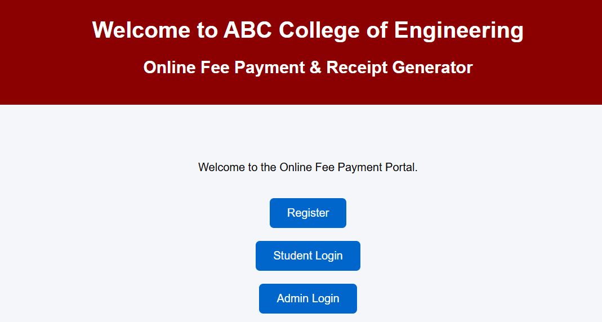
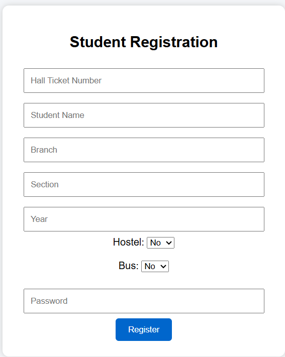
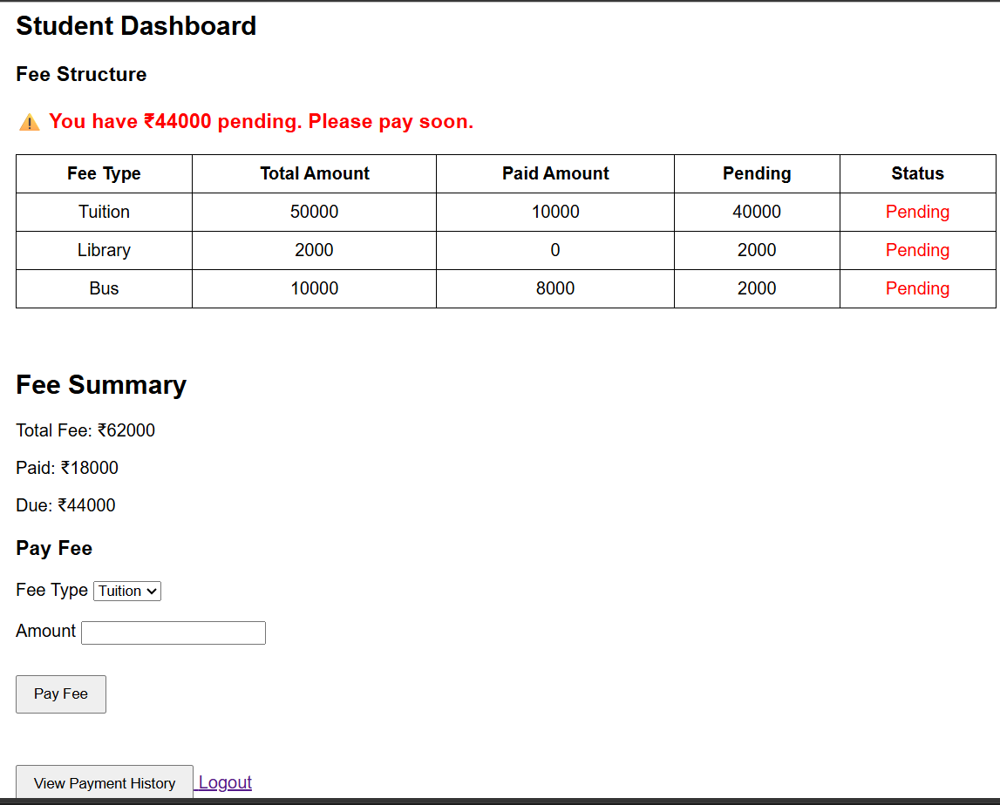
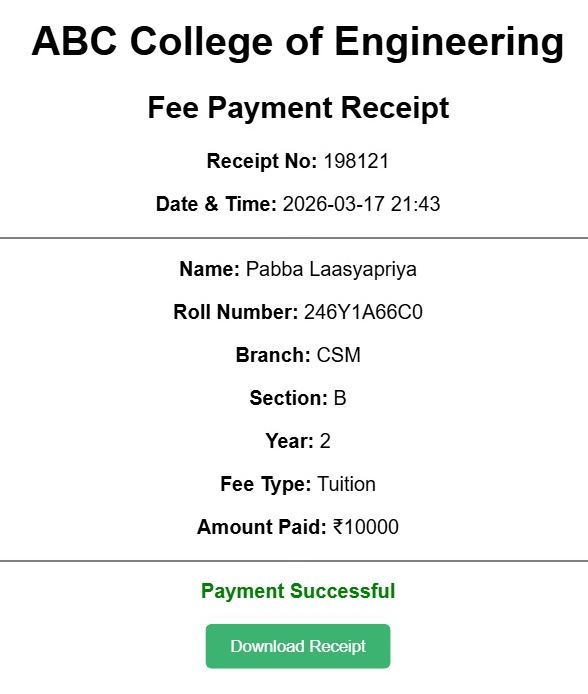
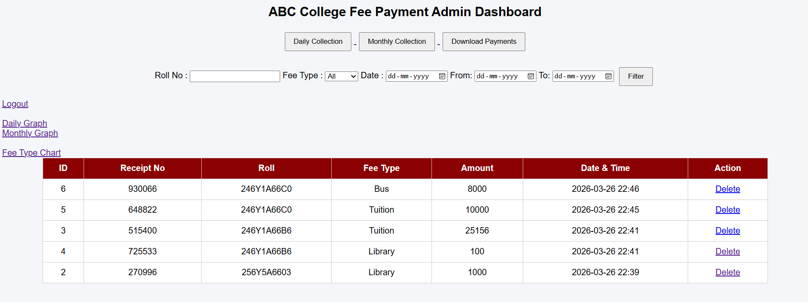
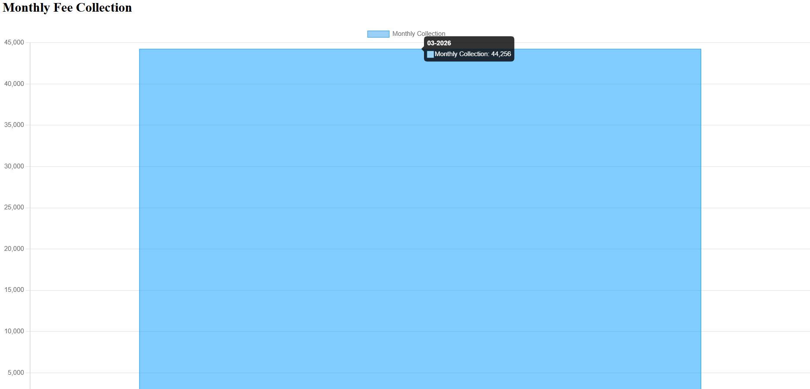

# 🎓 Online Fee Payment and Receipt Generator

## 📖 Project Overview

The **Online Fee Payment and Receipt Generator** is a web-based application developed using **Python Flask**, **HTML**, **CSS**, **JavaScript**, and **SQLite**. It simplifies the fee payment process by allowing students to pay fees online and download payment receipts, while administrators can efficiently manage fee records and monitor transactions.

---

## ✨ Features

### 👨‍🎓 Student Module
- Student Registration
- Secure Login
- View Fee Details
- Online Fee Payment
- Download PDF Receipt
- View Payment Status

### 👨‍💼 Admin Module
- Admin Login
- View All Transactions
- Delete Transactions
- Daily & Monthly Reports
- Pie Chart Analysis

---

## 🌟 Unique Features

- Dynamic Fee Assignment
- Hostel and Bus Fee Validation
- Automatic Receipt Generation
- Secure Session-Based Login
- Graphical Reports

---

## 🛠️ Technologies Used

- **Frontend:** HTML, CSS, JavaScript
- **Backend:** Python (Flask)
- **Database:** SQLite

---

## 🚀 Future Enhancements

- Online Payment Gateway Integration
- Email & SMS Notifications
- Password Reset using OTP
- Cloud Database Support

---

## 👩‍💻 Developed By

**Pabba Laasyapriya**

Department of Computer Science & Engineering

---

## 📌 Project Status

✅ Completed

## 📸 Project Screenshots

### 🏠 Home Page
  

### 📝 Student Registration

### 👤 Student Dashboard

### 🧾 Payment Receipt

### 👨‍💼 Admin Dashboard

### 📊 Monthly Collection Report

